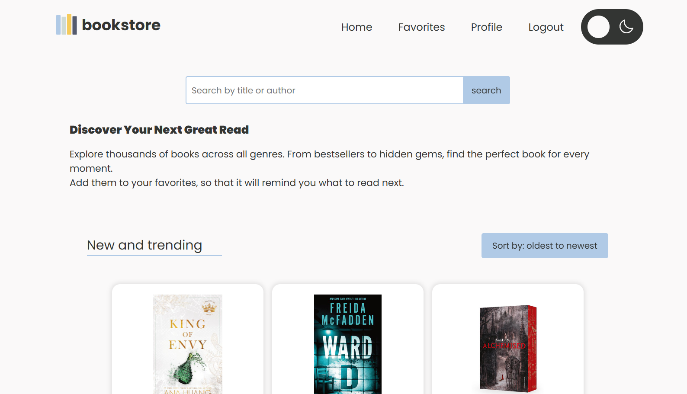
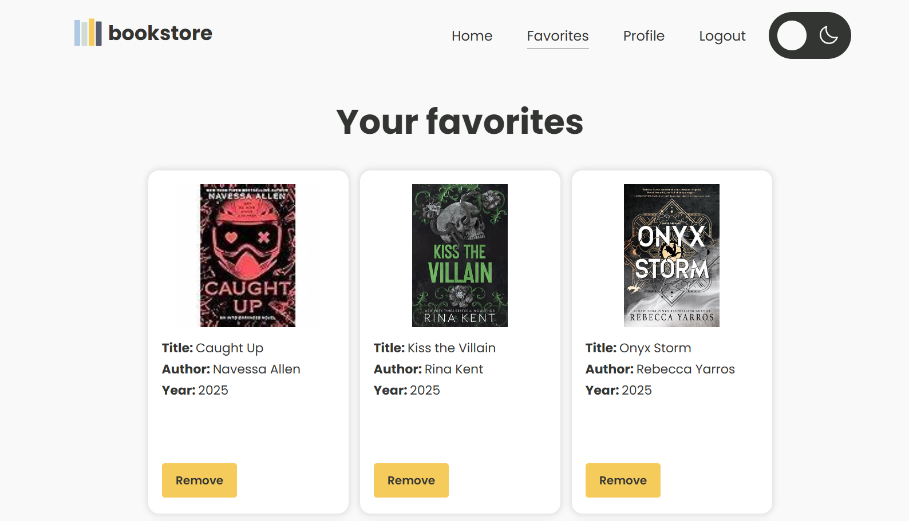

# Frontend eindopdracht app Bookstore

## Index

- 1 **Over Bookstore App**  
- 2 **Screenshots**  
    - 2.1 Homepage  
    - 2.2 Favorietenpagina  
- 3 **Installeren en benodigdheden**    
- 4 **De applicatie starten**  
- 5 **Dependencies**  
- 6 **Inloggen**  

---

## **1 - Over Bookstore App**

In deze applicatie kun je zoeken naar boeken. Je krijgt een selectie te zien met:
- Jaar van uitgave
- Auteur
- Samenvatting
- Mogelijkheid om boeken op te slaan als favoriet

---

## **2 - Screenshots**

### 2.2 Homepage


### 2.2 Favorietenpagina


---

### **3 - Installeren en benodigdheden**

Om deze applicatie te openen moet je een IDE(Integrated Development Environment) installeren, voor deze applicatie is Webstorm gebruikt, maar elk ander IDE kan gebruikt worden.
Om te starten heb je Node.js nodig (https://nodejs.org/en/download/), controleer of je deze al geïnstalleerd hebt door deze code in te voeren in je terminal (Alt+F12):

`node -v`

### **4 - De applicatie starten**

Als je het project gecloned hebt naar jouw locale machine, installeer je eerst alle dependencies door het volgende
commando in de terminal te runnen:

`npm install`

Wanneer dit klaar is, kun je de applicatie starten met behulp van:

`npm run dev`

Open (http://localhost:5173) om de pagina in de browser te bekijken.

### **5 - Dependencies**

Deze dependencies zijn gebruikt:

```md

- axios — ^1.13.2  
- dom — ^0.0.3  
- jwt-decode — ^4.0.0  
- phosphor-react — ^1.4.1  
- react — ^19.2.3  
- react-dom — ^19.2.0  
- react-hook-form — ^7.71.1  
- react-router-dom — ^7.11.0  
- router — ^2.2.0  
- use-local-storage — ^3.0.0  
```

### **6 - Inloggen**

Je kunt een account registreren of gebruikmaken van de voorbeeldaccount hieronder:

**email:** test5@gmail.com  
**wachtwoord:** Pass1234  

